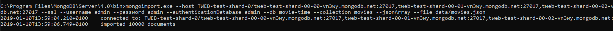

# tweb-test2 Olivier Kopp

## Importation des films

## Liste des films

La endpoint getMovies de graphql prend en parametre un offset et retourne une page de 100 film en fonction de celui-ci.

## Authentification

J'ai décidé de créer un endpoint register sur graphql plutot que de créer une route supplémentaire dans l'index.js. Cet endpoints retourne le user si il a pu etre crée ou null sinon.

## WatchList

Les endpoints addInWatchList et removeFromWatchList permette d'ajouter un tableau d'ID de film.
Le endPoint getWatchList retourne la liste de ID des film dans la watchList.